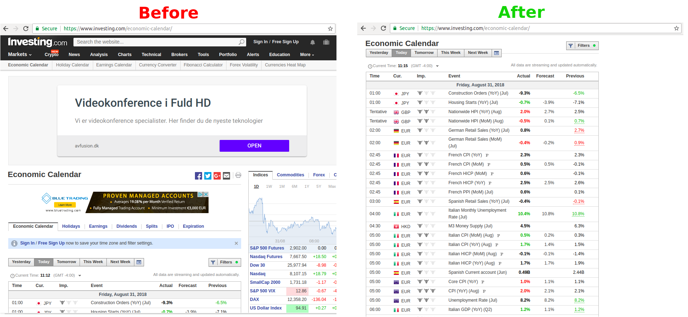

# Trader Stylist

Simplify your trading and investing websites.

Currently supported websites:
* investing.com/economic-calendar
* coinmarketcap.com

## Examples

## Why

Why was this extension developed?

* **No security risks** by requiring access only relevant trading websites.
  * Almost all other extensions that allow you to change the CSS and Javascript of your websites, require access to the data on all your websites. This opens security risks.
* **Open Source** - everyone can check the code, install locally the extension, contribute and comment
* **For traders** - made only for the most often used trading websites used by traders.

## Contribute

Please:

* use the Github issues to:
    * suggest new websites or features
    * report bugs
* use Github pull request to:
    * improve the code (with explanation)
    * add new websites
    * help with the TODOs below

## TODOs

* [ ] Create screenshots before and after
* [ ] Create icon for the extension
* [ ] Create main image for the extension
* [ ] Publish to chrome extensions
* [ ] Create similar Firefox extension
