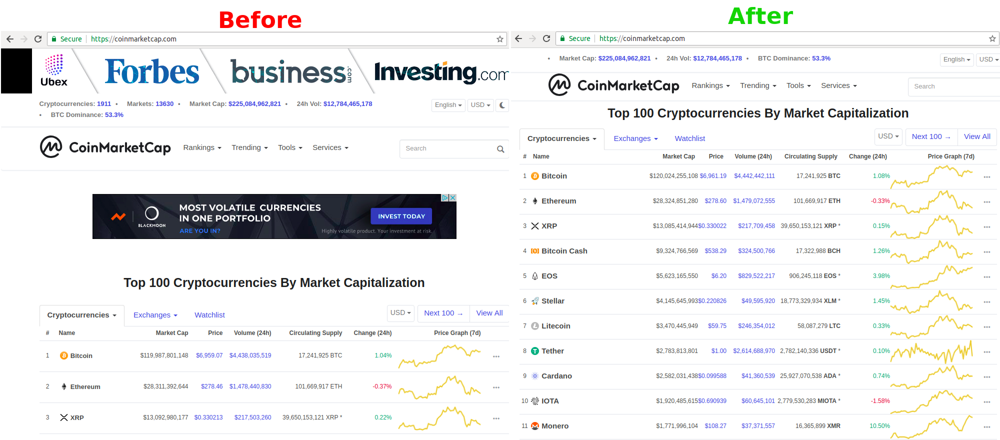

# Trader Stylist

Simplify your trading and investing websites.

Currently supported websites:
* [investing.com/economic-calendar](https://investing.com/economic-calendar/)
* [coinmarketcap.com](https://coinmarketcap.com)

## Examples

## Install

For Chrome/Chromium users:
* [Install Trader Stylist from the Chrome Webstorm](https://chrome.google.com/webstore/detail/trader-stylist/bohfeiboloihabanfodconoddbekccbl)

## Why

Why was this extension developed?

* **No security risks** by requiring access only relevant trading websites that do not have your personal data.
  * Almost all other extensions that allow you to change the CSS and Javascript of your websites, require access to the data on all your websites. This opens security risks.
* **Open Source** - everyone can check the code, install locally the extension, contribute and comment
* **For traders and investors** - made only for the most often used websites used by traders and investors.

## Contribute

Please:

* use the Github issues to:
    * suggest new websites or features
    * report bugs
* use Github pull request to:
    * improve the code (with explanation)
    * add new websites
    * help with the TODOs below

## How to add a new website

If you want to simplify the UI of a new website, please:
* first test your changes locally and make sure the UI is really simple and easy to use, without bugs
* create a new folder with the website name
* add CSS and/or Javascript files there
* add those references to those files at the bottom of manifest.json (similar to the other sites)
* make a pull request

## TODOs

* [ ] Create similar Firefox extension
